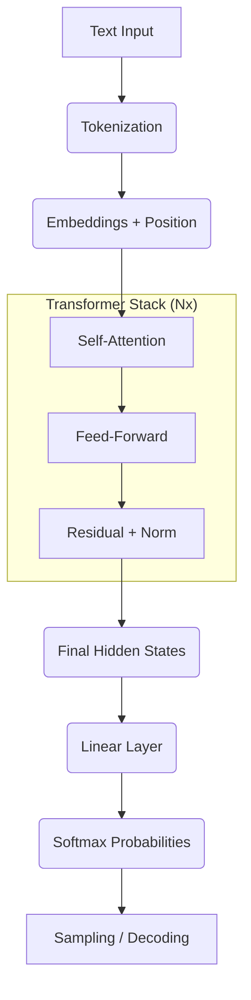

### 🧩 Step 1 — Tokenization (`Text` → `IDs`)
The model breaks raw strings into sub-word units and maps them to unique integers from its vocabulary.

> **Input:** `"I love transformers"`

| Index | Token | ID |
| :--- | :--- | :--- |
| 1 | `I` | `15` |
| 2 | ` love` | `438` |
| 3 | ` transformer` | `9021` |
| 4 | `s` | `29` |

**Numerical Representation:** `[15, 438, 9021, 29]`

---

### 🏛️ Step 2 — Embedding Layer (`ID` → `Vector`)
Words become points in high-dimensional space. Each token ID is converted into a vector of size $d_{model}$ (e.g., 768, 4096, or 12288).

**Visualization (Simplified to 5 Dimensions):**
```python
# Matrix Shape: [no. of tokens, embedding dimension] -> [4, 5]
[
 [  0.21, -0.33,  1.02,  0.44, -0.10 ], # "I"
 [  0.90,  0.12, -0.54,  0.31,  0.77 ], # " love"
 [ -0.45,  1.20,  0.88, -0.92,  0.11 ], # " transformer"
 [  0.05, -0.70,  0.33,  0.60, -0.22 ]  # "s"
]
```
At this point, our data has transitioned from a list of integers to a **Tensor**.

| Property | Value |
| :--- | :--- |
| **Matrix Shape** | `[no. of tokens, embedding dimension]` |
| **Example Shape** | `[4, 5]` |

> ### 🔍 Current State Analysis
> Even though tokens are now vectors, the model is still "blind" to the sequence:
> *   **No Context:** Tokens do not know each other yet.
> *   **No Attention:** Information has not been shared between vectors.
> *   **No Order:** The model doesn't know the sequence order.
> *   **Raw Meaning:** This is just a lookup of "static" word meanings.
