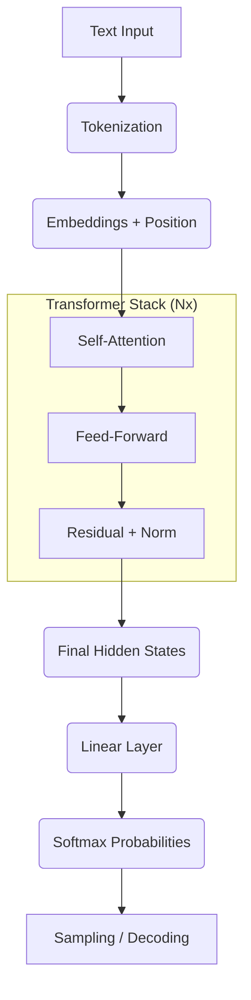

## Mathematical Foundations for Neural Networks & Transformers
### Check-list of math for transformer level understanding
```text
Vectors + matrices → linear layers
Dot products → similarity
Softmax → probabilities
Cross entropy → how wrong we were
Gradients → how to fix it
Nonlinearities → learning power
Normalization → stability
```
## 1. Linear Algebra

### 1.1 Vectors
Represent:
- Embedding vectors
- Hidden states
- Neuron activations

Example: h ∈ ℝ⁴⁰⁹⁶


### 1.2 Matrices
Represent model weights.

Example: W ∈ ℝ⁴⁰⁹⁶×⁴⁰⁹⁶


### 1.3 Matrix Multiplication
X × W
Used to combine information using weights.

Common Uses:
- Linear Layers
- QKV Projections
- Output Logits

### 1.4 Dot Product
Measures similarity between vectors.

Common Uses:
- Attention: `Q · K`
- Logits: `Hidden · Embedding`

### 1.5 Transpose
Wᵀ
Used when switching between input space and output space.


## 2. Geometry & Norms

### 2.1 Vector Norm (L2 Norm)
||x|| = sqrt(sum(xᵢ²))

Used in:
- Normalization
- Scaling attention scores

### 2.2 Cosine Similarity
cos(θ) = (a · b) / (||a|| ||b||)

Dot product without magnitude.

Used in:
- Embedding similarity
- Similarity-based reasoning


## 3. Non-Linear Activation Functions

- ReLU
- GELU

## 4. Probability & Distributions

### 4.1 Softmax
softmax(zᵢ) = exp(zᵢ) / sum(exp(z))
Turns logits into probabilities.

### 4.2 Temperature Scaling
softmax(z / T)


Controls randomness:
- **Low temperature** → Less random, more deterministic  
  - Good for legal document analysis
- **High temperature** → More random, more creative  
  - Good for chatbots and creative tasks


## 5. Loss & Information Theory

### 5.1 Cross-Entropy Loss
−log(P(correct))


### 5.2 Negative Log Likelihood Loss (NLLLoss)
Similar to cross-entropy loss for classification tasks.


## 6. Calculus

### 6.1 Derivative
Measures how one value changes when another changes.

### 6.2 Gradient
Vector of derivatives.
- Indicates direction to reduce loss
- Determines how weights should change

### 6.3 Chain Rule
Used in backpropagation to compute gradients through neural network layers.


## 7. Optimization

### 7.1 Gradient Descent
weight = weight - lr × gradient


### 7.2 Learning Rate
Controls the size of weight updates during training.

### 7.3 Adam Optimizer
Adaptive optimization algorithm with:
- Momentum
- Adaptive learning rates


## 8. Normalization & Stability

### 8.1 Mean & Variance
Used in Layer Normalization.

### 8.2 Layer Normalization
(x - mean) / std

Keeps activations stable across layers.


## 9. Attention-Specific Mathematics

### 9.1 Scaled Dot-Product Attention
softmax(QKᵀ / √d)


### 9.2 Masking
Prevents the model from seeing future tokens.
- Sets logits to `−∞` before softmax.
 
    
   
 


### 🧩 Step 1 — Tokenization (`Text` → `IDs`)
The model breaks raw strings into sub-word units and maps them to unique integers from its vocabulary.

> **Input:** `"I love transformers"`

| Index | Token | ID |
| :--- | :--- | :--- |
| 1 | `I` | `15` |
| 2 | ` love` | `438` |
| 3 | ` transformer` | `9021` |
| 4 | `s` | `29` |

**Numerical Representation:** `[15, 438, 9021, 29]`

---

### 🏛️ Step 2 — Embedding Layer (`ID` → `Vector`)
Words become points in high-dimensional space. Each token ID is converted into a vector of size $d_{model}$ (e.g., 768, 4096, or 12288).

**Visualization (Simplified to 5 Dimensions):**
```python
# Matrix Shape: [no. of tokens, embedding dimension] -> [4, 5]
[
 [  0.21, -0.33,  1.02,  0.44, -0.10 ], # "I"
 [  0.90,  0.12, -0.54,  0.31,  0.77 ], # " love"
 [ -0.45,  1.20,  0.88, -0.92,  0.11 ], # " transformer"
 [  0.05, -0.70,  0.33,  0.60, -0.22 ]  # "s"
]
```
Think of each dimension in an embedding as a specific **feature**. A token embedding (a high-dimensional vector) encodes various linguistic and semantic signals, such as:

*   **Is person-like:** Semantic category identifying animate entities.
*   **Is verb-like:** Part-of-speech signaling action or state.
*   **Tense:** Temporal information (past, present, future).
*   **Sentiment:** Emotional tone or valence.
*   **Subject/Object role:** Syntactic function within a sentence.
*   **Syntactic boundary:** Markers for phrases or clause ends.
*   **Topic:** Broad thematic associations.
*   **Discourse role:** Functional purpose in a conversation (e.g., question vs. answer).
  
At this point, our data has transitioned from a list of integers to a **Tensor**.

| Property | Value |
| :--- | :--- |
| **Matrix Shape** | `[no. of tokens, embedding dimension]` |
| **Example Shape** | `[4, 5]` |

> ### 🔍 Current State Analysis
> Even though tokens are now vectors, the model is still "blind" to the sequence:
> *   **No Context:** Tokens do not know each other yet.
> *   **No Attention:** Information has not been shared between vectors.
> *   **No Order:** The model doesn't know the sequence order.
> *   **Raw Meaning:** This is just a lookup of "static" word meanings.


## Step 3 - Query, Key, and Value Vectors
Each token is converted into 3 learned projections to create **Q**, **K**, and **V**.

### Weight Matrices
Each transformer layer utilizes 3 learned matrices:
*   $W_q = [768 \times 768]$
*   $W_k = [768 \times 768]$
*   $W_v = [768 \times 768]$

| Vector | Meaning |
| :--- | :--- |
| **Query (Q)** | What I’m looking for |
| **Key (K)** | What I offer |
| **Value (V)** | What info I share |

### The Projection
If the input matrix $X$ is $[4 \text{ tokens} \times 768 \text{ dims}]$:
*   $Q = X \times W_q$
*   $K = X \times W_k$
*   $V = X \times W_v$

**Shapes:** $[seq\_len \times 768] \times [768 \times 768] = [seq\_len \times 768]$

---

## Step 4 - Scaled Dot-Product Attention

**Setup:** 
*   Sequence length = 4 tokens
*   Embedding dimension ($d_k$) = 5 
*   $Q, K, V$ shape = $[4 \times 5]$

### 4.1 Compute Attention Scores
Each token is compared to every other token.
$$Q [4 \times 5] \times K^T [5 \times 4] = \text{scores} [4 \times 4]$$

**Scores Matrix:**
```text
[
 [2.1, 0.3, 1.4, 0.1],  <-- How Token 1 attends to Tokens 1..4
 [0.5, 2.2, 0.2, 0.9],  <-- How Token 2 attends to Tokens 1..4
 [1.1, 0.4, 2.5, 0.6],
 [0.2, 0.8, 0.3, 1.9]
]
```

# Step 4 - Scaled Dot-Product Attention

Let's assume:  
- Sequence length = 4 tokens  
- Embedding dimension = 5 → 4 tokens and 5 features each

Q [4 × 5]
K [4 × 5]
V [4 × 5]

---

## Step 4.1 - Compute Attention Scores

Each token is compared to every token:  

Q = [4 × 5]     <br>
Kᵀ = [5 × 4]   <br>
scores = [4 × 4]    <br>

```text
scores =
[
[2.1, 0.3, 1.4, 0.1],
[0.5, 2.2, 0.2, 0.9],
[1.1, 0.4, 2.5, 0.6],
[0.2, 0.8, 0.3, 1.9]
]
```

- Row = querying token  
- Column = target token  
- Example: Row 1 shows how token 1 attends to tokens 1–4

---

## Step 4.2 - Scale the Scores

Divide by √d_k  

- d_k = dimension of the Query or Key vectors  
- In this example: Q, K, V shape = [seq_len × 5], so d_k = 5  
- In real GPTs: Q, K, V shape = [seq_len × 768], so d_k = 768 

scaled_scores = scores / sqrt(d_k) => scores / 2.24

---

## Step 4.3 - Softmax (Turn into Probabilities)

```text
attention_weights =
[
[0.55, 0.08, 0.32, 0.05],
[0.12, 0.60, 0.05, 0.23],
[0.25, 0.09, 0.55, 0.11],
[0.07, 0.28, 0.10, 0.55]
]
```
---

## Step 4.4 - Mix Values

[4 × 4] × [4 × 5] = [4 × 5]
- Now we’re back to token-shaped vectors.

-------------------------------


